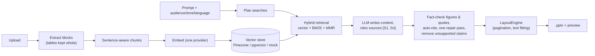

# Clarion: document-grounded PowerPoint generator

Upload your documents (PDF, DOCX, XLSX/CSV, PPTX, TXT, Markdown) into a project, describe the deck you need, and get an
editable 16:9 `.pptx` in which **every figure is fact-checked against your documents and every slide cites its sources**.
Layout is computed by code, so text and tables never overflow the slide.

Built for analysts, consultants, researchers and sales teams who work with private documents and need verifiable decks.
Product details: [`docs/PRD.md`](docs/PRD.md).

---

## The core rule

> **RAG decides what is relevant → the LLM writes a JSON `PresentationSpec` (content only) → the `LayoutEngine` decides all
> geometry → the `PresentationRenderer` writes the `.pptx`.**
> The LLM never produces coordinates, sizes, fonts, colours or positioning.

## How a deck is made



- **Ingestion:** per-format extractors (`backend/app/document_processing/`), tables stay intact, chunks never split a sentence.
- **Retrieval:** LLM-planned sub-queries, vector scores normalised per query plus BM25 keyword ranking, MMR for diversity (`rag/retriever.py`).
- **Generation:** a plain Python pipeline in `rag/graph.py` (not LangGraph). Sources are numbered, the LLM cites them by ID,
  and `rag/validator.py` checks that every figure appears in the cited sources (e.g. `$4.2M` = `$4,200,000`).
- **Layout:** `presentation/layout_engine.py` paginates tables and long lists ("(cont.)" slides) and shrinks titles and quotes to fit. 5 themes.
- **Jobs:** Celery + Redis, falling back to in-process background tasks. The UI polls job progress.
- **Resilience:** without API keys the app still runs (mock vector store, hash vectors + keyword ranking, and a
  no-LLM deck assembled verbatim from document excerpts).

## Stack

| | |
|---|---|
| Backend | Python 3.12, FastAPI, SQLAlchemy 2.0 (**sync**), Alembic, PostgreSQL, Celery + Redis, python-pptx |
| RAG | Pinecone / pgvector / in-memory store; OpenAI or Google (Gemini) embeddings; Anthropic / OpenAI / Google chat models via LangChain |
| Frontend | Next.js 16 (App Router), React 19, TypeScript, Tailwind CSS v4, TanStack Query, Zustand |

---

## Quick start (Docker Compose)

```bash
cp backend/.env.example backend/.env   # then fill in keys, SECRET_KEY, LLM_PROVIDER
docker compose up --build
```

- App: http://localhost:3000 · API docs: http://localhost:8000/docs
- The API and the worker share the `storage_data` volume (uploads and decks). The database schema is migrated on startup.

## Local development

```bash
# Backend
cd backend
python -m venv .venv
.venv\Scripts\activate            # Linux/macOS: source .venv/bin/activate
pip install -r requirements.txt
cp .env.example .env              # edit it
uvicorn app.main:app --reload --port 8000     # runs Alembic migrations on startup
celery -A app.workers.celery_app.celery_app worker --loglevel=info   # optional

# Tests (hermetic: no network, no real vector DB)
PYTHONPATH=. pytest               # PowerShell: $env:PYTHONPATH="."; pytest

# Frontend
cd frontend
npm install
npm run dev                       # http://localhost:3000
```

Schema changes: edit the models, then
`alembic revision --autogenerate -m "..."` from `backend/` (review the file) and restart the API, or run `alembic upgrade head`.

## Configuration (`backend/.env`)

All settings are in `backend/app/core/config.py`. The template is [`backend/.env.example`](backend/.env.example).
Values like `your_openai_api_key_here` are treated as **unset**.

| Variable | Purpose |
|---|---|
| `SECRET_KEY` | JWT signing key. Required unless `ENVIRONMENT=development` |
| `CORS_ORIGINS` | Comma-separated origins allowed to call the API |
| `DATABASE_URL` | PostgreSQL (sync driver) |
| `VECTOR_DB_TYPE` | `pinecone`, `pgvector` or `mock` |
| `LLM_PROVIDER`, `LLM_MODEL` | `anthropic` / `openai` / `google`, optional model override |
| `EMBEDDING_PROVIDER` | `auto` (OpenAI key → OpenAI, else Google key → Google, else hash), chosen once and never mixed |
| `EMBEDDING_DIMENSION` | Must equal the vector index dimension (default 1536) |

Changing the embedding provider, model or dimension puts vectors in a different space: re-index your documents
(the **Retry** button in the Documents tab, or delete and re-upload).

## Project docs

| | |
|---|---|
| [`docs/PRD.md`](docs/PRD.md) | Goals, users, features |
| [`docs/ARCHITECTURE.md`](docs/ARCHITECTURE.md) | How the code is organised and how data flows |
| [`docs/API.md`](docs/API.md) | Endpoints and the `PresentationSpec` contract |
| [`docs/DESIGN.md`](docs/DESIGN.md) | UI and deck themes |
| [`docs/DECISIONS.md`](docs/DECISIONS.md) | Why things are the way they are |
| [`docs/TASKS.md`](docs/TASKS.md), [`docs/PROGRESS.md`](docs/PROGRESS.md) | Backlog and session log |
